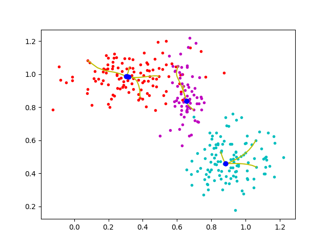

Mean-shift Clustering with Tensorflow
=====================================

Writen and maintained by Phong Le (p.le@uva.nl)

###Description 
Clustering using [mean shift](http://homepages.inf.ed.ac.uk/rbf/CVonline/LOCAL_COPIES/TUZEL1/MeanShift.pdf) with Gaussian kernel. 

###Requirements 

+ python 3.5
+ [tensorflow 0.12](https://www.tensorflow.org)

###Run

To set parameters, open `src/meanshift.py`

    n_samples = 300 # sample size
    n_centroids = n_samples # number of centroids
    n_updates = 50 # number of updates
    window_radius = .1 # window radius for the Gaussian kernels
    n_gaussians = 3 # 'true' number of clusters
       
Execute

    python3 src/meanshift.py
    

